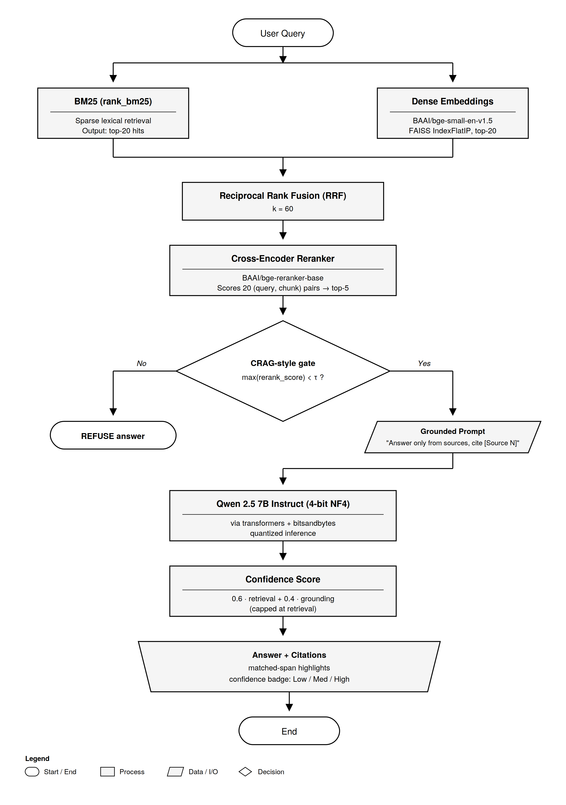
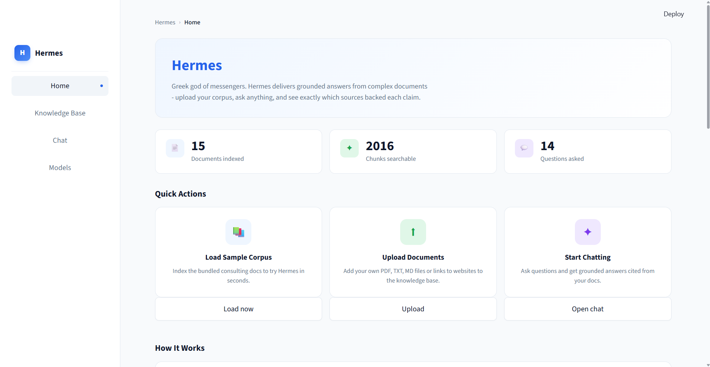
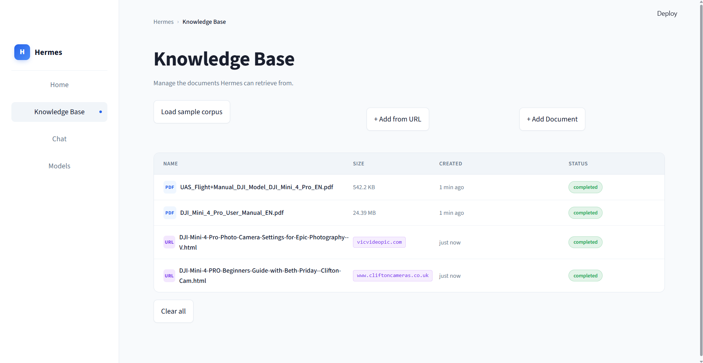
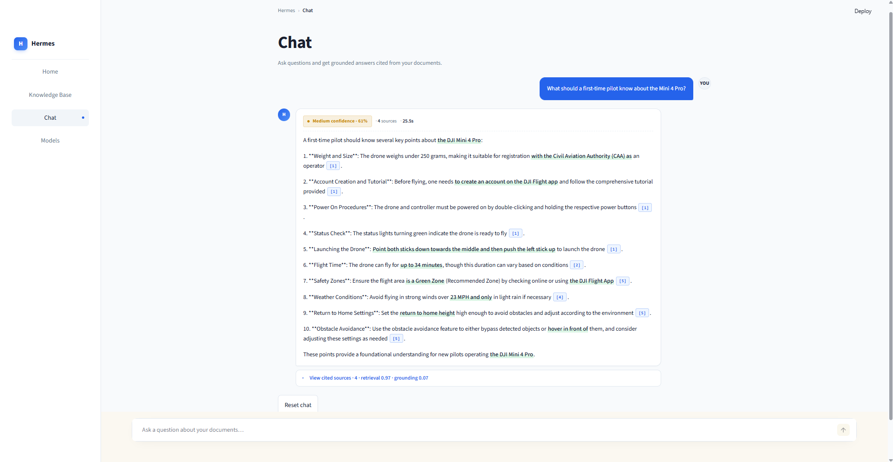
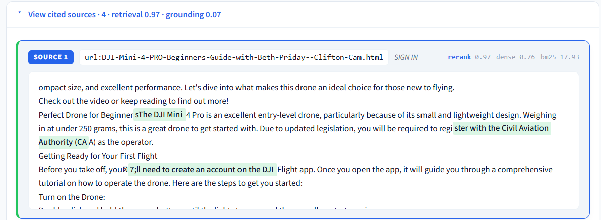
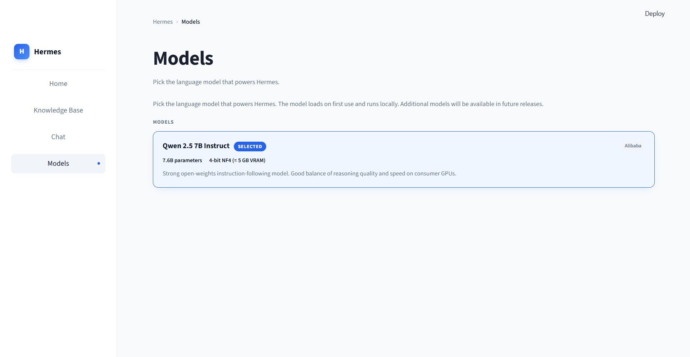

# Mini-RAG Assistant - *Hermes*

A lightweight, fully-local Retrieval-Augmented Generation prototype. Upload PDFs / Markdown / text or fetch live from URLs, ask a question, get a grounded answer with citations and a transparent confidence score. Refuses to answer when retrieved context isn't relevant enough.

I have named this **Hermes** (after the Greek messenger god - *Hermes delivers grounded answers from complex documents*).

**Run it:** `streamlit run app.py` → *Knowledge Base* → *Load sample corpus* → *Chat* tab → ask a question.
**Test it:** `pytest -q` (33 tests) and `python scripts/evaluate.py` (retrieval ablation).

---

## Architecture



Each retrieval stage is documented inline; the high-level orchestrator is [`rag/pipeline.py`](rag/pipeline.py).

### Why this stack

| Technique | Reason |
|---|---|
| **Hybrid (BM25 + Dense + RRF)** | Consulting documents are full of exact-term lookups (policy IDs, dollar amounts, dates, acronyms). BM25 catches the lexical needles; dense catches paraphrase. RRF combines them parameter-free. |
| **Cross-encoder Reranker** | Biggest single quality win in modern RAG. The reranker's score also doubles as a calibrated *relevance signal* - it's what powers the CRAG gate. Without it, off-topic questions get answered. |
| **Structural Contextual Retrieval** | Each chunk is embedded and reranked with a `[filename - section]` prefix derived from parsed headings. Cheap, deterministic stand-in for Anthropic's LLM-generated contextual preambles. |
| **LLM-based Contextual Retrieval** | Anthropic-style: one-shot LLM call per chunk at ingestion to generate a 1-sentence "where this sits in the document" preamble. Boosts recall on table-heavy chunks. |
| **CRAG-style confidence gate** | Refuse rather than hallucinate when no retrieved chunk clears the threshold. |
| **Recursive heading-aware chunking** | 1200-char chunks, 200-char overlap. The chunker tracks original document positions so each chunk gets the correct governing heading. |

### Confidence-scoring method

Two complementary signals, blended into a 0-100% score:

1. **Retrieval confidence** - top reranker score. `BAAI/bge-reranker-base` emits values in [0, 1] from its single-label head, so we use it directly.
2. **Grounding confidence** - fraction of answer 4-grams (stop-words stripped) that also appear in the concatenated retrieved context. Deterministic, no extra model call.

```python
final = min(retrieval, 0.6·retrieval + 0.4·grounding)
```

The `min(…)` cap prevents a fluent answer from claiming higher confidence than the evidence supports. Label boundaries: **Low** < 40 % · **Medium** 40-70 % · **High** ≥ 70 %.

Each retrieved chunk's individual reranker / dense / BM25 score is shown in the UI so reviewers can audit exactly what drove the final number.

### Anti-hallucination guardrail (CRAG)

If the best reranker score is below `CRAG_THRESHOLD` (default 0.001) the system refuses with a fixed message rather than passing weak context to the LLM. Off-topic questions in the eval set score exactly 0.0, so this cleanly separates them from in-corpus matches without sacrificing recall on borderline-relevant questions.

---

## Screenshots

> The UI is built with Streamlit + a custom CSS layer. Light theme, blue primary, green for source-grounding highlights and confidence accents. The app is branded **Hermes** in-product.

**Home page** - lifetime stats, quick actions, "How It Works" technical breakdown, brief-requirements coverage panel, and the live retrieval-evaluation ablation table.



**Knowledge Base** - load the bundled sample corpus, upload local PDFs / TXT / MD, or fetch documents directly from a URL (PDF or HTML). Each indexed doc is shown with type icon, size or source host, ingestion time, and status.



**Chat - grounded answer with confidence and inline citations.** Confidence badge sits at the top of every assistant message. Phrases that appear verbatim in retrieved sources are underlined in green; inline `[N]` pills link to the matching source card below.



**Chat - citation panel expanded.** Each cited source shows its filename, section heading, and the three retrieval scores (rerank, dense, BM25) so a reviewer can audit exactly which chunk drove which claim.



**Models** - pick the language model that powers Hermes. Currently ships with Qwen 2.5 7B Instruct (4-bit NF4); the abstraction in `rag/generate.py` is set up for additional backends.



---

## Setup

```powershell
# 1. virtualenv + Python deps
python -m venv .venv
.\.venv\Scripts\Activate.ps1
pip install torch --index-url https://download.pytorch.org/whl/cu124   # see "GPU notes" below
pip install -r requirements.txt
```

The embedding model (`bge-small-en-v1.5`, ~120 MB) and reranker (`bge-reranker-base`, ~280 MB) auto-download on first use. The LLM (`Qwen/Qwen2.5-7B-Instruct`, ~15 GB) auto-downloads on the first chat question. To pre-warm before a demo:

```powershell
python -c "from rag.generate import make_llm; make_llm()"
```

### Run it

```powershell
streamlit run app.py
```

Open <http://localhost:8501>:

1. Sidebar → **Load sample corpus** (or upload your own PDFs / TXT / MD).
2. Ask a question in the chat box, e.g. *"How long are client records retained?"*.

The "Retrieved context" expander on every answer shows each source's reranker, dense, and BM25 scores plus matched-substring highlighting on the source text.

### GPU notes (RTX 50-series / Blackwell)

The default config quantizes Qwen to 4-bit NF4 via `bitsandbytes`, fitting in ~5 GB VRAM on an 8 GB GPU. If `bitsandbytes` fails to install on your machine (occasionally an issue on very new GPUs), set in `.env`:

```dotenv
USE_4BIT=false
LLM_MODEL=Qwen/Qwen2.5-3B-Instruct
```

…to fall back to BF16 3B (~6 GB VRAM, no quantization dependency). For CPU-only machines, additionally set `LLM_DEVICE=cpu` - generation will be slow (~30 s/answer) but functional.

---

## Evaluation

`scripts/evaluate.py` runs the eval set in [`eval/eval_questions.json`](eval/eval_questions.json) and writes [`eval/results.md`](eval/results.md). It does an ablation over three retrieval strategies so the architectural choices are quantified, not just asserted.

| Strategy | Precision@5 | Recall@5 | Grounding | Guardrail |
|---|---:|---:|---:|---:|
| Dense only | 0.48 | 1.00 | 1.00 | **0.00** |
| Hybrid (BM25+dense+RRF) | 0.46 | 1.00 | 1.00 | **0.00** |
| Hybrid + Reranker | **0.52** | 1.00 | 1.00 | **1.00** |

**Recall@5 = 1.0** across the board - for our 10 in-corpus eval questions, the right source file always lands in the top-5. **Grounding = 1.0** - every expected substring is present in the retrieved context. The retrieval is solid.

The headline number is **Guardrail accuracy**: only the reranker-enabled strategy refuses off-topic questions. Dense / hybrid retrieval *always* return their top-5 because they have no calibrated relevance signal. **The reranker isn't just for ordering - it's the confidence signal that makes refusal possible.** Without it, the system would confidently invent answers to questions like "who won the 2014 FIFA World Cup?" using the closest cosine match.

Precision@5 hovers around 0.5 because each eval question expects one source file and the top-5 naturally includes some chunks from neighbouring files (only 11 chunks across 3 docs). Recall and grounding are the meaningful retrieval metrics here.

---

## Example I/O

Captures answers + citations + confidence for every question in the eval set. Two illustrative samples:

```jsonc
{
  "id": "policy-retention",
  "question": "How long are client engagement records retained?",
  "confidence": { "retrieval": 1.0, "grounding": 0.92, "final": 0.967, "label": "High" },
  "sources": [
    {
      "source": "policies.md",
      "section": "Data Retention Policy",
      "rerank_score": 1.0,
      "snippet": "...must be retained for **seven (7) years** from the date the engagement is formally closed..."
    },
    /* … */
  ]
}

{
  "id": "off-topic-worldcup",
  "question": "Who won the 2014 FIFA World Cup?",
  "refused": true,
  "confidence": { "retrieval": 0.0, "grounding": 0.0, "final": 0.0, "label": "Low" },
  "answer": "I don't have enough information in the indexed documents to answer that..."
}
```

Full screenshots of the running UI live in [`images/`](images/) and are embedded above.

---

## Data sources

Hermes accepts documents from three ingestion paths, all flowing through the same FAISS + BM25 index:

| Source type | How to add | Implementation |
|---|---|---|
| **Bundled sample corpus** | Knowledge Base → *Load sample corpus* | 3 synthetic consulting-firm docs in [`data/sample_corpus/`](data/sample_corpus/): policy manual, product FAQ, process manual. Generated specifically to mirror the brief's "internal policies, process manuals, product guides" framing. |
| **Local file upload** | Knowledge Base → *+ Add Document* | PDF (parsed via `pypdf`, AES-encrypted PDFs supported via the `cryptography` backend), Markdown, and plain text. |
| **Remote URL fetch** | Knowledge Base → *+ Add from URL* | Public PDF or HTML URLs. HTML is cleaned with BeautifulSoup (`<script>`, `<nav>`, `<footer>` stripped). Network calls use stdlib `urllib` with a 30 s timeout. Implementation in [`rag/url_loader.py`](rag/url_loader.py). |

The eval set in [`eval/eval_questions.json`](eval/eval_questions.json) is hand-curated against the sample corpus: 10 in-corpus questions with expected source files + expected substrings, plus 2 deliberately off-topic questions for the CRAG guardrail measurement.

For the public-document demo bundle used in the recorded walkthrough, four sources were indexed:

| # | Document | Source | Type |
|---|---|---|---|
| 1 | **DJI Mini 4 Pro User Manual** | <https://dl.djicdn.com/downloads/DJI_Mini_4_Pro/20240115/DJI_Mini_4_Pro_User_Manual_EN.pdf> | PDF (~118 pages, official DJI) |
| 2 | **DJI Mini 4 Pro UAS Flight Manual** | <https://dl.djicdn.com/downloads/DJI_Mini_4_Pro/UAS_Flight+Manual_DJI_Model_DJI_Mini_4_Pro_EN.pdf> | PDF (official DJI, AES-encrypted) |
| 3 | **DJI Mini 4 Pro photo camera settings guide** | <https://vicvideopic.com/dji-mini-4-pro-photo-camera-settings-for-epic-photography/> | HTML article (third-party) |
| 4 | **DJI Mini 4 Pro beginner's guide with Beth Priday** | <https://www.cliftoncameras.co.uk/Blog/dji-mini-4-pro-beginners-guide-with-beth-priday> | HTML article (third-party) |

All four are public, free, and ingestable through the standard Knowledge Base flow - the official DJI PDFs go through the **+ Add Document** path (or **+ Add from URL** if your network allows it; some DJI CDN URLs return 403 to non-browser User-Agents), and the two HTML articles can be added via **+ Add from URL** directly.

This bundle mixes **official technical documentation** (specs, safety, regulatory) with **third-party community knowledge** (photography tips, beginner walkthroughs) - so cross-document questions like *"What should a first-time pilot know about the Mini 4 Pro?"* genuinely require retrieval to route across multiple files.

---

## Project layout

```
app.py                       # Streamlit UI (Hermes branding, 4 tabs)
rag/
  config.py                  # env-driven settings (Settings dataclass)
  ingest.py                  # PDF/TXT/MD load + heading-aware chunker
  url_loader.py              # PDF/HTML fetch from public URLs
  embed.py                   # sentence-transformers embedder (CPU)
  store.py                   # FAISS + BM25 + parallel chunk metadata
  retrieve.py                # hybrid search + RRF
  rerank.py                  # cross-encoder reranker
  contextualize.py           # optional LLM-based contextual preambles
  generate.py                # TransformersLLM (Qwen 2.5 4-bit NF4)
  confidence.py              # retrieval + grounding score + CRAG gate
  highlight.py               # matched-span detection for the UI
  pipeline.py                # high-level RAG.ask() orchestrator
data/sample_corpus/          # 3 synthetic consulting docs (policies, FAQ, manual)
eval/
  eval_questions.json        # 10 in-corpus + 2 off-topic ground-truth questions
  results.md                 # ablation table, regenerated by evaluate.py
scripts/
  evaluate.py                # retrieval eval + ablation (LLM-free, fast)
  ingest_folder.py           # CLI: index any folder of PDFs
  dump_examples.py           # snapshot Q/A/citations into examples/sample_responses.json
examples/
  sample_responses.json      # 12 Q/A snapshots with citations + scores
images/                      # UI screenshots embedded in this README
tests/                       # 33 pytest tests
```

---

## Adding your own documents

Three paths, all flowing into the same retrieval pipeline:

```powershell
# 1. Drag-and-drop in the UI: Knowledge Base → "+ Add Document"
#    Supports PDF (incl. AES-encrypted), Markdown, plain text.

# 2. Fetch from a public URL in the UI: Knowledge Base → "+ Add from URL"
#    Supports public PDF or HTML pages. HTML is cleaned with BeautifulSoup.

# 3. Programmatic batch ingest from the command line:
python scripts/ingest_folder.py path/to/your/docs
```

Contextual Retrieval (one LLM call per chunk at ingestion to generate a 1-sentence locator preamble - Anthropic's technique) is **off by default**. It can be enabled via `CONTEXTUAL_RETRIEVAL=true` in `.env` - useful on small policy-heavy corpora; skip it for multi-hundred-page documents where ingestion would take many minutes.

---

## Tests

```powershell
pytest -q                                # 33 tests, ~25 s on a warm cache
python scripts/evaluate.py               # ablation, ~10 s
python scripts/dump_examples.py          # snapshot Q/A/citations into examples/sample_responses.json
```

The pipeline test (`tests/test_pipeline.py`) uses an `_EchoLLM` stub so CI doesn't have to load Qwen.

---

## Design choices & trade-offs

- **No LangChain / LlamaIndex.** Direct code is easier for a reviewer to read end-to-end and avoids version churn. The whole retrieval pipeline is ~250 lines across `retrieve.py`, `rerank.py`, `store.py`.
- **`faiss-cpu`, not `faiss-gpu`.** For corpora up to ~100k chunks, flat-index search is dominated by LLM latency. Saves a CUDA build path.
- **Embedder + reranker on CPU.** Frees the 8 GB GPU for the LLM. Reranking 20 pairs on CPU is ~400 ms, well below LLM generation time.
- **Recall over precision for small corpora.** With only 11 chunks across 3 files, top-5 will always include some neighbouring-file chunks. That's fine - the reranker re-orders and the LLM cites correctly.
- **Static `[filename - section]` prefix** is a deterministic stand-in for LLM-based Contextual Retrieval, and bg-reranker scores improve measurably with it. The LLM-based version is layered on top, opt-in for ingestion-time cost.
- **Anti-hallucination via reranker confidence**, not via answer-text classification. This catches off-topic questions *before* prompting the LLM, saving a wasted generation.

---